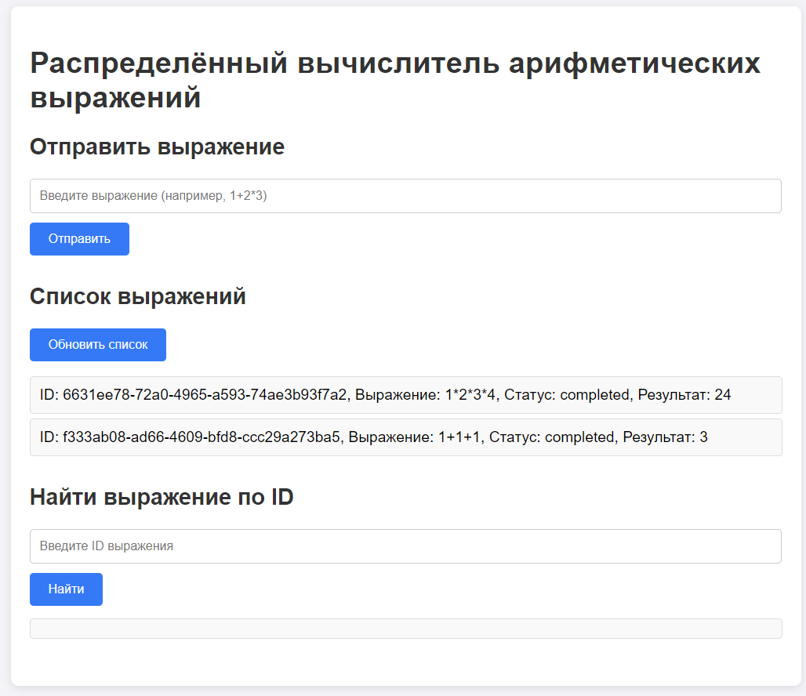

# Распределённый вычислитель арифметических выражений

Финальная задача второго спринта курса Яндекс Лицея по Golang

---

## О проекте

Данный проект реализует веб-сервис который получает математическое выражение и разделив его на несколько отдельных задач считает их параллельно и возвращает пользователю результат

---

## Структура проекта
```
cmd/
├── agent/
│   └── main.go # Основная программа для запуска агента
├── orchestrator/
│   └── main.go # Основная программа для запуска оркестратора
internal/
├── agent/
│   ├── agent.go # Логика запуска воркеров, а также их работы
│   └── types.go # Используемые агентом структуры
├── orchestrator/
│   ├── orchestrator.go # Главная логика оркестратора (регистрация хендлеров, реализация AST и т.д)
│   └── types.go # Используемые оркестратором структуры
pkg/
├── calc/
│   ├── calc.go # Пакет для токенизирования выражения, создания польской нотации и т.д.
│   └── calc_test.go # Тесты для пакета
└── getEnv.go # Пакет для получения данных из переменных среды с возможностью указания стандартного значения
.env # Переменные среды
.gitignore
go.mod
README.md # <- Вы тут :)
```

Использованные библиотеки:
- Gorilla Mux для удобного роутинга
- Google UUID для генерации уникального ID выражениям и задачам
- Godotenv для импорта переменных окружения из файла .env
- RS CORS для настройки CORS на бэкенд-сервере

---

## Архитектура

Система работает по следующему принципу:
1. Клиент отправляет выражение оркестратору
1. Оркестратор разбивает выражение на бинарное дерево выражений и рекурсивно создаёт задачу для каждой операции
1. Свободные воркеры берут задачу и считают её (подождав указанное время)
1. Воркер отправляет результат обратно Оркестратору
1. Оркестратор ждет для каждого выражения пока все его задачи не посчитаются
1. При завершении всех операций Оркестратор меняет статус задачи и возвращает её пользователю
<details>
    <summary>Пример AST-дерева выражения ((7+3)∗(5−2))</summary>


</details>
---

## Frontend

Также реализован небольшой frontend для удобства использования веб-сервиса
<details>
    <summary>Frontend</summary>


</details>

Frontend доступен по адресу http://localhost:8081

---

## Установка и запуск проекта

### Установка

1. Склонируйте репозиторий и перейдите в папку
```sh
git clone https://github.com/AzizovHikmatullo/calc-go_V2
```
```sh
cd calc-go_V2
```
2. Установите зависимости
```sh
go mod tidy
```

### Запуск

1. Переименуйте .env.example в .env и переменные среды

| Переменная                | Описание                                                     | Значение по умолчанию |
|---------------------------|--------------------------------------------------------------|-----------------------|
| `COMPUTING_POWER`         | Количество запускаемых воркеров                              | 5                     |
| `PING_MS`                 | Задержка перед повторной отправкой запроса оркестратору (мс) | 1000                  |
| `TIME_ADDITION_MS`        | Время обработки операции сложения (мс)                       | 1000                  |
| `TIME_SUBTRACTION_MS`     | Время обработки операции вычитания (мс)                      | 1000                  |
| `TIME_MULTIPLICATIONS_MS` | Время обработки операции умножения (мс)                      | 2000                  |
| `TIME_DIVISIONS_MS`       | Время обработки операции деления (мс)                        | 3000                  |

2. Запустите оркестратор
```sh
go run cmd/orchestrator/main.go
```
3. В отдельном терминале запустите агента
```sh
go run cmd/agent/main.go
```
4. Также можете запустить фронтенд в отдельном окне:
```sh
go run web/main.go
```

Также для проверки вы можете использовать программу Postman

## Использование API

---

## `POST /api/v1/calculate`
### Пример запроса:
```bash
curl --location 'localhost:8080/api/v1/calculate' \
--header 'Content-Type: application/json' \
--data '{"expression": "2 + 2 * 2"}'
```

### Ответы сервиса:
1. Выражение принятно для вычисления
    - HTTP код: `201`
    - Тело ответа:
       ```json
       {"id": "<id выражения>"}
       ```

2. Некорректное выражение:
    - HTTP код: `422`
    - Тело ответа:
      ```json
      "Invalid request body"
      ```

3. Что-то пошло не так:
    - HTTP код: `500`
    - Тело ответа:
      ```json
      "Internal server error"
      ```
      
## `GET /api/v1/expressions`
### Пример запроса:

```bash
curl --location 'localhost:8080/api/v1/expressions'
```
### Ответы сервиса:
1. Успешно получен список выражений
    - HTTP код: `200`
    - Пример ответа:
    ```json
   {
       "expressions":[
       {
           "id":"300f0829-8bb5-4357-88ae-2053c6a93223",
           "expression":"2 + 2 * 2",
           "status":"completed",
           "result":6
       },
       {
           "id":"dea262b4-8bb0-4f39-8bfd-89a15830eeff",
           "expression":"someletters",
           "status":"error",
           "result":0
       }]
   }
    ```

2. Что-то пошло не так:
    - HTTP код: `500`
    - Тело ответа:
      ```json
      "Internal server error"
      ```

## `GET /api/v1/expressions/:id`
### Пример запроса:
```bash
curl --location 'localhost:8080/api/v1/expressions/300f0829-8bb5-4357-88ae-2053c6a93223'
```
### Ответы сервиса:
1. Успешно получен список выражений
    - HTTP код: `200`
    - Пример ответа:
    ```json
    {
        "expression": {
            "id": "300f0829-8bb5-4357-88ae-2053c6a93223",
            "expression": "2 + 2 * 2",
            "status": "completed",
            "result": 6
        }
    }
    ```
2. Выражение не найдено
    - HTTP код: `404`
    - Тело ответа:
      ```json
      "Expression not found"
      ```

3. Что-то пошло не так
    - HTTP код: `500`
    - Тело ответа:
      ```json
      "Internal server error"
      ```

## `GET /internal/task`
### Пример запроса:
```bash
curl --location 'localhost:8080/internal/task'
```
### Ответы сервиса:
1. Успешно получена задача
    - HTTP код: `200`
    - Пример ответа:
    ```json
    {
        "task": {
            "id": "ad634e1f-137b-4041-b60b-feb2b27609d7",
            "expression_id": "dc6d1dc0-5123-4c81-9447-3e7977967430",
            "operation": "+",
            "arg1": 1,
            "arg2": 2,
            "status": "queued",
            "operation_time": 3000
        }
    }
    ```
2. Нет задачи для выполнения
    - HTTP код: `404`
    - Тело ответа:
      ```json
      "No tasks available"
      ```

## `POST /internal/task`
### Пример запроса:
```sh
curl --location 'localhost:8080/internal/task' \
--header 'Content-Type: application/json' \
--data '{
  "id": 1,
  "result": 4,
  "expression_id": 1
}'
```

### Ответы сервиса:
1. Результат задачи успешно записан
    - HTTP код: `200`
   

2. Задача не найдена
    - HTTP код: `404`
    - Тело ответа:
      ```json
      "Task not found"
      ```

3. Некорректные данные:
    - HTTP код: `422`
    - Тело ответа:
      ```json
      "Invalid request"
      ```
